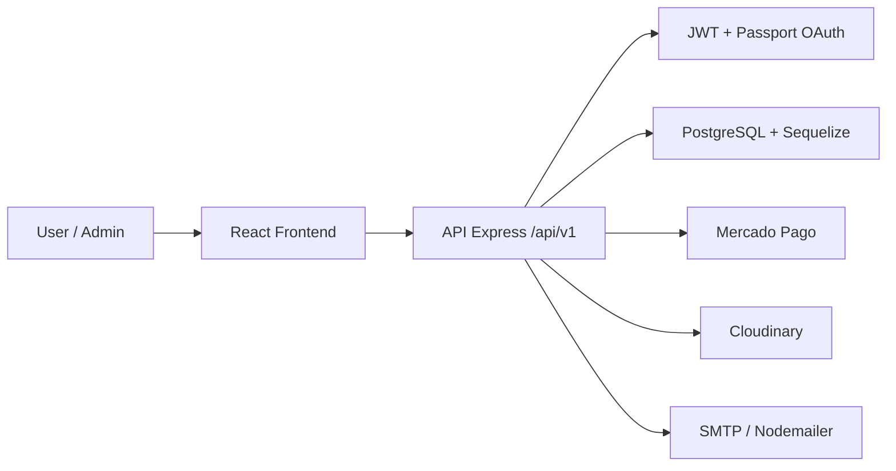

# Architecture

## Overview

Salvando Huellas is organized as a full stack application with a React frontend and an Express backend. The frontend consumes a versioned REST API under `/api/v1`; the backend handles request validation, business logic, persistence, authentication and external services.

## General Flow



## Frontend

Main responsibilities:

- Render the public experience: home, adoption, store, events, donations and information pages.
- Manage the user session with a JWT stored in `localStorage`.
- Protect admin views with `RequireAdmin`.
- Consume centralized HTTP services from `src/services`.
- Reuse UI components from `src/components/ui`.

Relevant folders:

```text
frontend/src/pages       # Main views
frontend/src/components  # Reusable components
frontend/src/services    # HTTP clients for the API
frontend/src/hooks       # UI hooks
frontend/src/layouts     # Root layout
```

## Backend

Main responsibilities:

- Expose the REST API.
- Validate requests with `express-validator`.
- Execute business rules in service modules.
- Persist entities with Sequelize.
- Centralize authentication and error handling.
- Integrate external services.

Relevant folders:

```text
backend/src/routes       # Endpoint definitions
backend/src/controllers  # HTTP layer
backend/src/services     # Business logic
backend/src/models       # Sequelize models
backend/src/validations  # Input validation
backend/src/middlewares  # Auth, errors and validation middleware
backend/src/configs      # DB, Passport, Cloudinary and associations
```

## Modules

- **Auth:** registration, login, password recovery and optional OAuth.
- **Users:** profile and user management.
- **Animals:** public catalog, detail view and admin management.
- **Adoptions:** adoption requests and admin review.
- **Store:** products, cart, purchases and orders.
- **Donations:** donation records and payments.
- **Events:** activity publishing and management.
- **Uploads:** image uploads through Cloudinary.
- **Contact:** messages sent to the rescue organization.

## Security

Current measures:

- JWT for protected routes.
- `user` and `admin` roles.
- Password hashing with bcrypt.
- Helmet for HTTP security headers.
- Request validation before controllers.
- Secrets kept outside the repository through `.env` files.

Recommended improvements:

- Validate required environment variables at startup.
- Restrict CORS by domain in production.
- Validate Mercado Pago webhook signatures.
- Add rate limiting for login, registration and password recovery.
- Consider secure cookies if the session strategy is changed in the future.

## Persistence

The database uses PostgreSQL with Sequelize. In development the project can sync models with `sequelize.sync`; in production, database changes should be handled with migrations.

## Integrations

- **Mercado Pago:** payments for purchases and donations.
- **Cloudinary:** animal and product images.
- **Nodemailer/SMTP:** contact messages and password recovery.
- **Google/Facebook OAuth:** optional social login.
