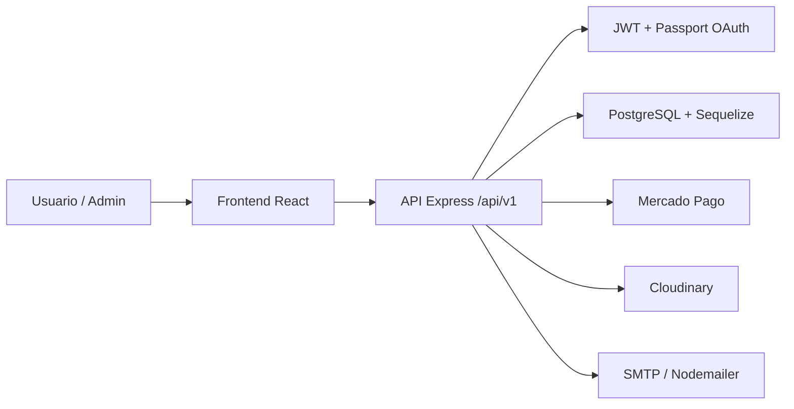

# Arquitectura

## Resumen

Salvando Huellas está organizado como una aplicación full stack con frontend React y backend Express. El frontend consume una API REST versionada en `/api/v1`; el backend concentra validaciones, reglas de negocio, persistencia y servicios externos.

## Vista General



## Frontend

Responsabilidades principales:

- Renderizar la experiencia pública: inicio, adopción, tienda, eventos, donaciones e información.
- Gestionar sesión con token JWT en `localStorage`.
- Proteger vistas administrativas con `RequireAdmin`.
- Consumir servicios HTTP centralizados en `src/services`.
- Reutilizar componentes de UI en `src/components/ui`.

Carpetas relevantes:

```text
frontend/src/pages       # Vistas principales
frontend/src/components  # Componentes reutilizables
frontend/src/services    # Clientes HTTP hacia la API
frontend/src/hooks       # Hooks de UI
frontend/src/layouts     # Layout raíz
```

## Backend

Responsabilidades principales:

- Exponer API REST.
- Validar requests con `express-validator`.
- Ejecutar reglas de negocio en servicios.
- Persistir entidades con Sequelize.
- Centralizar errores y autenticación.
- Integrar servicios externos.

Carpetas relevantes:

```text
backend/src/routes       # Definición de endpoints
backend/src/controllers  # Adaptan HTTP a servicios
backend/src/services     # Reglas de negocio
backend/src/models       # Modelos Sequelize
backend/src/validations  # Validaciones de entrada
backend/src/middlewares  # Auth, errores y validación
backend/src/configs      # DB, Passport, Cloudinary, asociaciones
```

## Módulos

- **Auth:** registro, login, recuperación de contraseña y OAuth.
- **Usuarios:** perfil y administración de usuarios.
- **Animales:** catálogo, detalle y gestión administrativa.
- **Adopciones:** solicitudes y seguimiento administrativo.
- **Tienda:** artículos, carrito, compras y pedidos.
- **Donaciones:** registro de donaciones y pagos.
- **Eventos:** publicación y administración de actividades.
- **Uploads:** carga de imágenes en Cloudinary.
- **Contacto:** envío de mensajes a la protectora.

## Seguridad

Medidas actuales:

- JWT para rutas protegidas.
- Roles `user` y `admin`.
- Hash de contraseñas con bcrypt.
- Helmet para cabeceras HTTP.
- Validaciones de entrada.
- Ocultamiento de secretos mediante `.env`.

Mejoras recomendadas:

- Validar variables críticas al iniciar el backend.
- Restringir CORS por dominio en producción.
- Validar firma de webhooks de Mercado Pago.
- Agregar rate limiting para login, registro y recuperación de contraseña.
- Evitar almacenar tokens de sesión en `localStorage` si se migra a cookies seguras.

## Persistencia

La base de datos usa PostgreSQL con Sequelize. En desarrollo se puede sincronizar con `sequelize.sync`; en producción se recomienda usar migraciones.

## Integraciones

- **Mercado Pago:** pagos de compras y donaciones.
- **Cloudinary:** imágenes de animales y productos.
- **Nodemailer/SMTP:** contacto y recuperación de contraseña.
- **Google/Facebook OAuth:** login social opcional.
